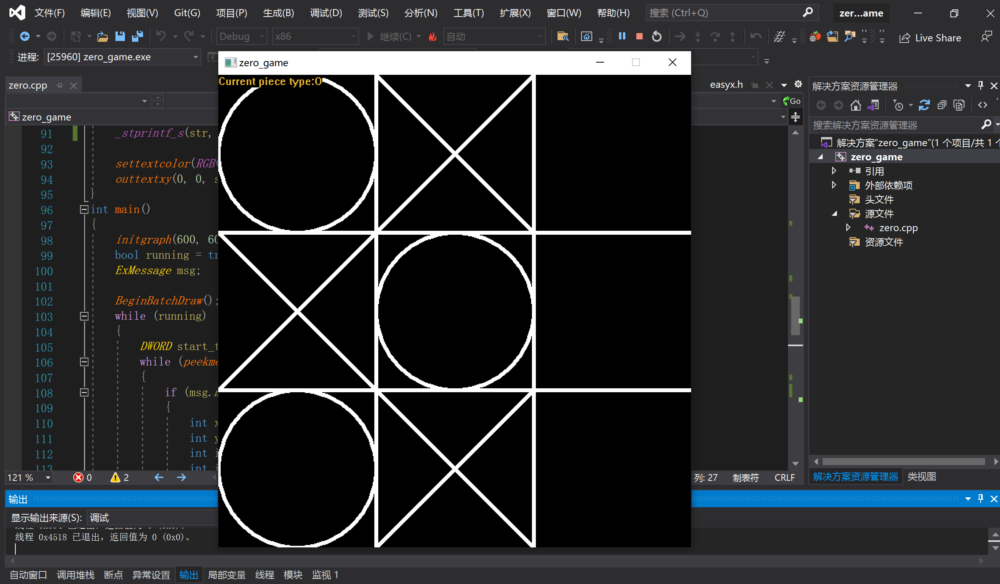
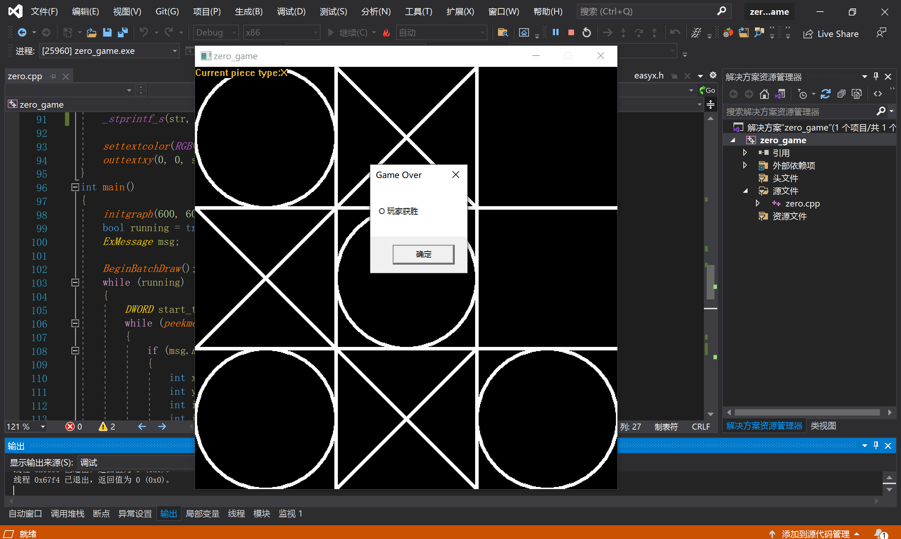

# C++ 游戏开发Tic-tac-toe井字游戏

## 项目简介
本项目是基于 C++ 和 EasyX 库的游戏开发项目，旨在展示如何使用 C++ 制作简单的井字棋小游戏。通过本项目，您可以学习到如何使用 EasyX 进行绘图、处理鼠标输入以及实现基本的游戏逻辑。

## 项目内容
- 使用 EasyX 进行绘图
- 处理鼠标输入
- 实现井字棋游戏逻辑

## 如何运行
1. 克隆本仓库到本地
2. 使用 EasyX 库编译和点击sln,运行项目代码
3. 按照视频教程中的步骤加载游戏资源、实现游戏逻辑

## 文件结构
- `main.cpp`: 主程序文件，包含游戏的主要逻辑
- `images/`: 存放游戏所需的图片资源
- `README.md`: 项目说明文档

## 注意事项
- 请确保安装 EasyX 库，并按照视频教程中的步骤操作
- 在运行程序时，注意调整窗口大小和位置以获得最佳显示效果

## 后续计划
- 实现游戏的双人对战模式
- 添加游戏音效和背景音乐
- 优化游戏界面和用户交互体验

